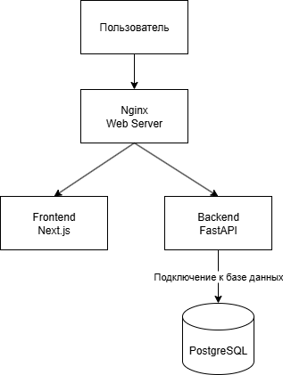
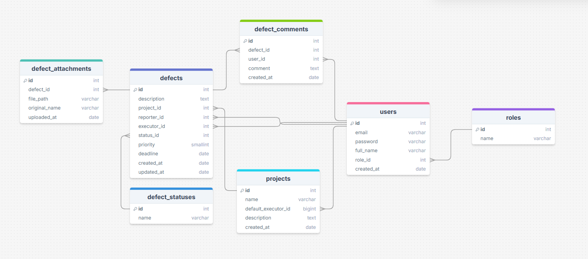
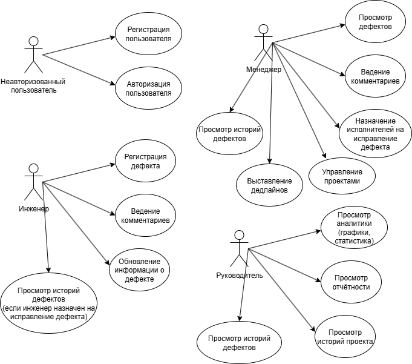

# ООО «СистемаКонтроля» по работе с строительными объектами

---

### Технологии
> 
> 
> 
>  Backend:
> 
> 
> 

>   Frontend:
> 
> 
> 
 Architecture: 

---

## Анализ требований технического задания
В техническом задании сказано, что необходимо создать веб-приложение для управления дефектами на строительных объектах. Пользователями будут инженеры, менеджеры, руководители (заказчики).
### Функциональные требования, представленные в техническом задании
1.	Регистрация пользователей и аутентификация.
2.	Разграничение прав доступа (менеджер, инженер, наблюдатель).
3.	Управление проектами/объектами и их этапами.
4.	Создание и редактирование дефектов (заголовок, описание, приоритет, исполнитель, сроки, вложения).
5.	Управление статусами дефектов: Новая → В работе → На проверке → Закрыта/Отменена.
6.	Ведение комментариев и истории изменений.
7.	Поиск, сортировка и фильтрация дефектов.
8.	Экспорт отчётности в CSV/Excel.
9.	Просмотр аналитических отчётов (графики, статистика).
### Нефункциональные требования, представленные в техническом задании
1.	Время отклика страницы ≤ 1 секунды (для 50 активных пользователей).
2.	Обеспечить резервное копирование БД раз в сутки.
3.	Интерфейс на русском языке, адаптивный под ПК/планшеты.
4.	Совместимость с Chrome/Firefox/Edge последних версий.
5.	Пароли хранить с использованием bcrypt или argon2.
6.	Защита от SQL-инъекций, XSS и CSRF.

---

## Роли пользователей
> ### Инженер
   Роль инженера – основной исполнитель. Инженер регистрирует дефекты, вносит информацию, добавляет комментарии и приложенные файлы. Инженер может редактировать внесенную информацию. 
> ### Менеджер
   Менеджер исполняет роль координатора. Он управляет назначением, контролирует сроки и формирует отчетность для руководителей. Менеджер управляет сменой статуса работы с дефектами. Статусы дефектов: новая, в работе, на проверке, закрыта или отменена.
> ### Руководитель (заказчик)
   Руководитель – это лицо, которое осуществляет мониторинг и анализ устранения дефектов. Доступен просмотр аналитической отчетности.

---

## Архитектура монолитного приложения и технологический стек
Приложение с клиент-серверной архитектурой. Next.js отвечает за frontend и SSR, FastAPI – за backend API, Nginx выступает как reverse proxy и сервер статики.
### Технологический стек
- Backend: FastAPI
- ORM: SQLAlchemy
- Хранение всех данных: PostgreSQL
- Frontend: Next.js 14+, TypeScript
- Инфраструктура: Docker, Docker Compose
- Web Server: Nginx
- Аутентификация: JWT-токены

### Архитектура проекта

### ER-диаграмма

### UseCase диаграмма

